  

I'm a B.Tech CSE student specialising in Cloud Computing. I build hands-on cloud and automation projects with AWS, Python and Docker, and I'm working towards a Cloud & DevOps engineering role.

## Featured Projects

| Project | What it does | Links |
|---|---|---|
| **Smart Cloud Autoscaling & Cost Optimizer** | Rule-based autoscaler that reads CPU usage with psutil, scales between 1 and 5 servers, and estimates hourly and daily cost. Flask dashboard, Docker image and a CI pipeline on GitHub Actions | [Code](https://github.com/SoyabKhan560/smart-cloud-autoscaling-cost-optimizer) |
| **Smart Cloud Dashboard** | Web dashboard for the autoscaler with CPU, autoscaling, cost and alert pages. The live demo runs on simulated data | [Live](https://smart-cloud-autoscaling-cost-optimi.vercel.app) · [Code](https://github.com/SoyabKhan560/smart-cloud-dashboard) |
| **AWS S3 with boto3** | Python scripts that create S3 buckets, list buckets and objects, upload files and read object size | [Code](https://github.com/SoyabKhan560/CloudAWS) |
| **Emergency Help Page** | One-tap calls to Indian emergency numbers, live location sharing and a first-aid guide | [Live](https://soyabkhan560.github.io/shoaib-emergency-ai/) · [Code](https://github.com/SoyabKhan560/shoaib-emergency-ai) |

## Tech Stack

## Certifications

| Certificate | Issued by | Date | Proof |
|---|---|---|---|
| **Java (Basic)** | HackerRank skill certification test | 30 Sep 2025 | [Verify](https://www.hackerrank.com/certificates/4f3dddb9a502) |
| **Introduction to Generative AI** | Simplilearn SkillUp, course powered by Google Cloud | 24 Sep 2025 | [View](./certificates/introduction-to-generative-ai-simplilearn.pdf) |

## Career Goal

Aspiring **Cloud & DevOps Engineer**. I learn by building projects on real cloud services and automating how they are built and deployed.

## Connect

- LinkedIn: [soyab-khan](https://www.linkedin.com/in/soyab-khan-9b2a33333/)

Always learning. Always building. Always improving.
